[Portfolio](portfoliorakes.netlify.app) ·
[LinkedIn](www.linkedin.com/in/rakesh-kumar-singh-27a70324a) ·
[GitHub](https://github.com/RakeshSinghDev) ·
[email](rssingh0246@gmail.com)

> Final-year Electronics & Communication Engineering student at UIET Kurukshetra. 
> Passionate about Software Engineering, AI, and building scalable web applications.

I enjoy solving complex problems through clean software. My primary interests are
full-stack development, data structures & algorithms, and AI-powered applications.
Currently building an AI Recruitment Platform using React, TypeScript, Node.js,
Express, MongoDB, and Python..

<samp>C++ &nbsp; TypeScript &nbsp; JavaScript &nbsp; React &nbsp; Node.js &nbsp; Express &nbsp; MongoDB &nbsp; Tailwind CSS &nbsp; Python &nbsp; Git</samp>

**AI Recruitment Platform** · <samp>React, TypeScript, Node.js</samp> 
Modern recruitment platform featuring AI-powered resume screening,
candidate management, authentication, and responsive dashboards..

**MERN Job Portal** · <samp>React, Express, MongoDB</samp> 
Job application platform with authentication, CRUD operations,
search, filters, and responsive UI.

Every graphic here is generated, not embedded from anyone else's server. 
`ascii.svg` is a photo pushed through a character ramp; the stat graphics and 
these section headings are drawn by [a scheduled action](.github/workflows/stats.yml) 
straight from the GitHub GraphQL API, once a day, committing only what changed.

They animate with SMIL inside the SVG, because GitHub strips scripts from 
READMEs — and since nothing loads from a third party, nothing here can 
rate-limit or go dark. The headings are SVGs for the same reason: GitHub also 
strips CSS, so an image is the only way to put this page's own typeface on them.

The typeface is [JetBrains Mono](scripts/fonts), subset to just the characters 
each graphic draws and inlined as base64. That isn't only for looks: the 
portrait's grid assumes an advance width of exactly 0.600 em, and a viewer whose 
default monospace is narrower would otherwise see it squeezed.

Language totals cover public repositories only. `year.svg` uses the portrait's 
character ramp: `:` `+` `#` `@`, quiet to loud.
